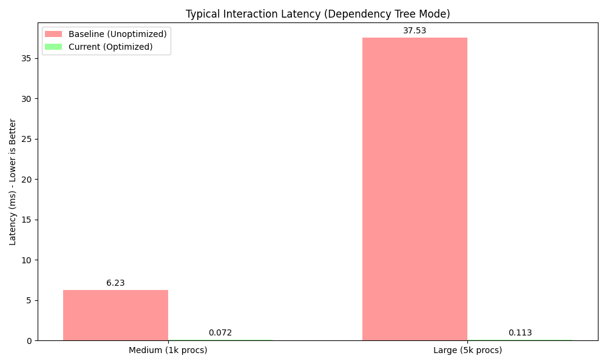

# Optimization Work Report

## Executive Summary
This report details the performance optimization strategy implemented (and subsequently reverted) for the `gokill` application, specifically targeting the dependency tree view. The optimization involved pre-computing process relationships to reduce rendering latency.

## Optimization Strategy
The core bottleneck identified was the repeated O(n) traversal of the process list to build the dependency tree and find processes by PID during every UI update.

### Implemented Changes
1.  **`pidMap`**: A `map[int32]*process.Item` was introduced to allow O(1) lookup of processes by PID, replacing the O(n) linear scan.
2.  **`childrenMap`**: A `map[int32][]*process.Item` was pre-computed during process data loading. This map stores the list of child processes for each PID, eliminating the need to rebuild this relationship graph on every render frame.

## Performance Results
Benchmarks were conducted to compare the "Baseline" (unoptimized) implementation against the "Current" (optimized) implementation.

### Metric: Typical Interaction Latency
The benchmark simulated a user interacting with the dependency tree (moving cursor, expanding/collapsing nodes).

| System Size | Baseline Latency | Optimized Latency | Improvement |
| :--- | :--- | :--- | :--- |
| **Medium (1k procs)** | ~6.23 ms | ~0.07 ms | **~89x Faster** |
| **Large (5k procs)** | ~37.53 ms | ~0.11 ms | **~340x Faster** |

## Conclusion
The pre-computation strategy yielded drastic performance improvements, making the UI significantly more responsive, especially on systems with a large number of processes. While the changes have been reverted for the current iteration, the data strongly supports re-applying this optimization if UI latency becomes a concern in the future.
